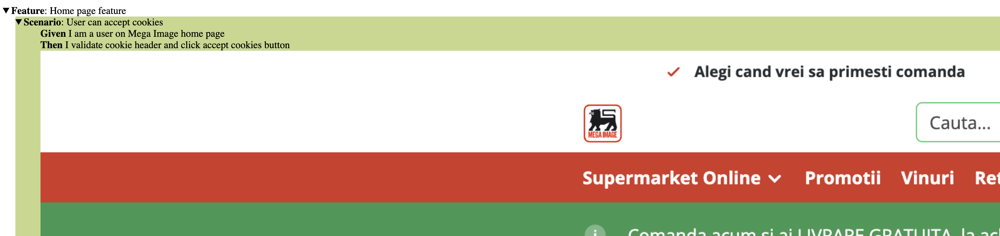
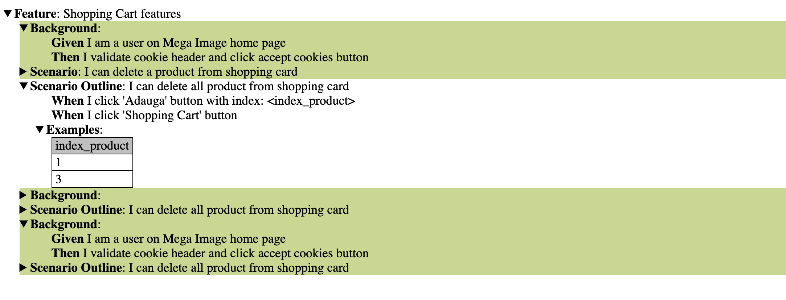

# BDD Cucumber Tests for mega-image.ro

## 📚 Technologies:

BDD (Behavior Driven Development):

- features folder
- steps folder
- Cucumber Library
- Gherkin
- Java & IntelliJ IDEA
- Page Object Model (POM) in pages folder

## 📝 Commands in cmd file for Cucumber and Selenium:

- Install Selenium WebDriver
- Install Cucumber for Java
- Install Gherkin
- Install WebDriver Manager for Selenium

## ➡️ Gherkin syntax keywords:
- Feature
- Given, When, Then, And, But for steps (or *)
- Background
- Scenario
- Scenario Outline - data in tables + Examples
## ➡️ POM:
- Classes, objects, methods
- OOP: Inheritance principle

## ⏩ Steps to download the repository:
1. Navigate to the upper level of the project.
2. Click on the blue ‘Code’ button.
3. Choose either ‘Open with GitHub Desktop’ if you have installed ‘GitHub Desktop’ on your computer or ‘Download ZIP’ to download as a ZIP document.
4. Make sure you use IntelliJ IDEA with this repository.
5. Install the commands from the cmd file.

## ✅ Tests performed:
### 1. Feature: Home page feature
- Scenario:
    - User can accept cookies
    - Check if the user can accept cookies.

### 2. Feature: Register Features
- Background:
  - Given I am a user on Mega Image home page
  - Then I validate cookie header and click accept cookies button
  - When I click 'Contul meu' button

- Scenarios: Missing email and password
  - Check when email and password are not entered.

- Scenario: Negative: Invalid email
  - Check when an invalid email is entered.

- Scenario Outline: Negative: Valid email and invalid password
  - Check when a valid email and an invalid password are entered.
  - Test data for email and password.

- Scenario Outline:Positive: Valid email and password
  - Check when a valid email and password are entered.
  - Test data for email and password.

- Scenario: Negative: Invalid password, when I don't fill any email
  - Check when an invalid password is entered without filling any email.

### 3. Feature: Shopping Cart Features
- Background:
  - Given I am a user on Mega Image home page
  - Then I validate cookie header and click accept cookies button

- Scenarios: I can add and delete a product from shopping card
  - Test data for index_product_1: 1

- Scenario Outline: I can delete all products from the shopping cart
  - Test data for index_product_1: 0, 3
  - Test data for index_product_2: 3, 6

